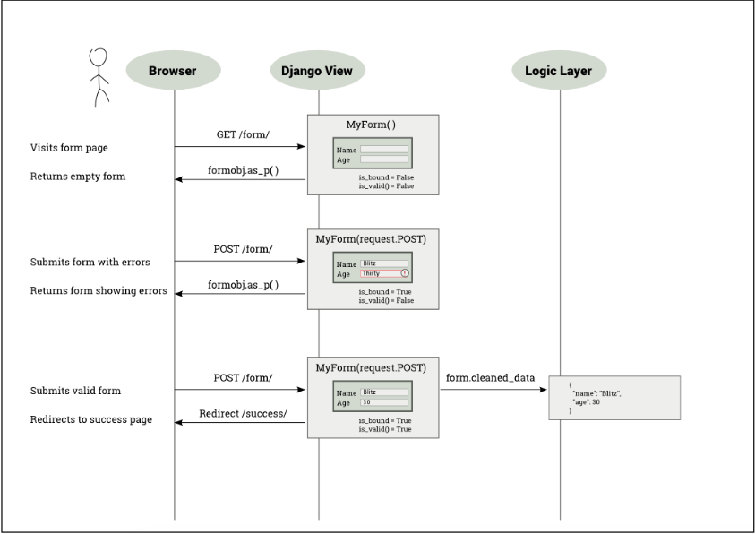
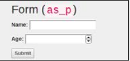
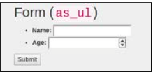
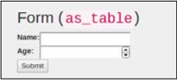
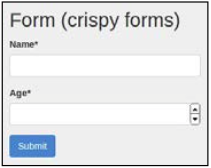

第七章-表单
***********

这一章我们会讨论一下话题：  

- 表单的工作流程
- 不可靠的输入
- 表单处理类视图
- 表单与CRUD视图

我们把Django表单放到一边，来讨论下常规情况下的表单是个什么样子。表单不仅长，而且有着多个需要填充的无趣的页面。可以说表单无所不在。我们每天都用到它。表单支撑了谷歌搜索框到脸书的点赞按钮这所有的一切。  

Django把使用表单时产生的验证和描述这类的大量繁重工作给抽象了。它也实现了多种的安全问题的最佳实践。可是，表单在处理自身多个状态之一时也是令人困惑的起因。  

## 表单的工作原理
表单理解起来比较困难，因为它同不止一个请求-响应循环交互。最简单的场景是，你需要展示一个空表单，然后用户来正确地填充和提交表单。另外一种情况是它们输入一些无效的数据，表单需要重复的提交知道整个表单有效为止。  

因此，表单表现出多种状态：  


- 空表单：在Django中此表单称为未绑定表单
- 已填充表单：Django中该表单称为已绑定表单
- 有错误的已提交表单：该表单称做已绑定表单，但不是有效表单
- 没有错误的已提交表单：该表单称做已绑定且有效的表单

注意用户永远不会见到表单的最后状态。他们不必如此。提交的有效表单应当把用户带到表单提交成功之后的页面。  

## Django中的表单
通过总结它们到一个层次，Django的`form`类每个字段的状态，以及表单自身。 如下所示，表单拥有两个重要的状态属性：  

-  *is_bound*: 如果返回值为假，则它是一个未绑定的表单，即，新的空表单，或者默认的字段值。如果返回值为真，表单被绑定，即，至少有一个用户设置的字段。

- *is_valid()*: 如果返回值为真，已绑定表单中的所有字段都拥有有效的数据。如果返回假，至少有一个字段中存在一部分无效数据，或者表单未被绑定。

举例来说，想象一下你需要一个接受用户名字和年龄的简单表单。这个类可以这样来定义：  

```python
# forms.py
from django import forms


class PersonDetailsForm(forms.Form):
    name = forms.CharField(max_length=100)
    age = forms.IntegerField()
```

该类可以以绑定或者不绑定方式来初始化，一如下面代码所示：  

```shell
>>> f = PersonDetailsForm()
>>> print(f.as_p())
<p><label for="id_name">Name:</label> <input id="id_name" maxlength="100"
name="name" type="text" /></p>
<p><label for="id_age">Age:</label> <input id="id_age" name="age"
type="number" /></p>
>>> f.is_bound
False
>>> g = PersonDetailsForm({"name": "Blitz", "age": "30"})
>>> print(g.as_p())
<p><label for="id_name">Name:</label> <input id="id_name" maxlength="100"
name="name" type="text" value="Blitz" /></p>
<p><label for="id_age">Age:</label> <input id="id_age" name="age"
type="number" value="30" /></p>
>>> g.is_bound
 True
```

要注意HTML是如何表现改变以包括它们中已绑定数据的值属性。  

表单可以只在你创建表单对象时才被绑定，即，在构造器中。用户如何在类字典对象的最后面输入每个表单字段的值？  

要想解决这个问题，你需要理解用户是如何与表单交互的。在下面的的图表中，用户打开用户账户表单，首先是正确地填充，并提交它，然后用有效信息重新提交表单：  



如前面的表单所示，当用户提交表单时，在`request.POST`（它是一个`QueryDict`的实例）内部所有可调用的视图获取到全部的表单数据。表单使用类字典对象——以这种方式引用是因为它的行为类似于字典，来初始，并拥有一点额外的功能。  

表单可以通过两种不同的方式来定义以发送数据表单：`GET`或者`POST`。表单使用`METHOD=“GET”`定义以发送以URL编码的表单数据，例如，当你提交谷歌搜索时，URL取得表单输入，即，搜索字符串显式地嵌入，比如`?q=Cat+Pictures`就是如此。`GET`方法用来幂等表单，它不会对世界状态做出任何的最新改变。（不要太过于迂腐，多次处理有同样的效果就像一次处理）。大多数情况下，这意味着它只在重新取回数据时被用到。  

不过，不计其数的表单都是使用`METHOD=“POST”`来定义的。这样，表单数据会一直发送HTTP请求的主体部分，而且它们对于用户来说是不可见的。它们被用于任何涉及到边际效应的事情，比如存储或者更新数据。  

视你所定义表单类型的不同，当用户提交表单时，视图会重新取回`request.GET`或者`request.POST`中的表单数据。如同早前咱么提到的那样，它们中的哪一个都类似于字典。因此，你可以传递它到表单类构造器以获取绑定的`form`对象。  

>#### 注释
**The Breach**
Steve was curled up and snoring heavily in his large three-seater couch. For the last few weeks, he had been spending more than 12 hours at the office, and tonight was no exception. His phone lying on the carpet beeped. 􏰅t first, he said so􏰀ething incoherently, still deep in sleep. Then, it beeped again and again, in increasing urgency.

>By the fifth beep, 􏰆teve awoke with a start. He frantically searched all over his couch, and finally located his phone. The screen showed a brightly colored bar chart. Every bar seemed to touch the high line except one. He pulled out his laptop and logged into the SuperBook server. The site was up and none of the logs indicated any unusual activity. However, the external services didn't look that good.

>The phone at the other end seemed to ring for eternity until a croaky voice answered, 􏰇Hello, 􏰆teve?􏰇 Half an hour later, 􏰈acob was able to 􏰄ero down the proble􏰀 to an unresponsive superhero verification service. 􏰇Isn't that running on 􏰆auron?􏰇 asked 􏰆teve. There was a brief hesitation. "I am afraid so," replied Jacob.

>Steve had a sinking feeling at the pit of his stomach. Sauron, a 􏰀ainfra􏰀e application, was their first line of defense against cyber-attacks and other kinds of possible attack. It was three in the morning when he alerted the mission control team. Jacob kept chatting with him the whole time. He was running every available diagnostic tool. There was no sign of any security breach.

>Steve tried to calm him down. He reassured him that perhaps it was a temporary overload and he should get some rest. However, he knew that Jacob wouldn't stop until he found what's wrong. He also knew that it was not typical of Sauron to have a temporary overload. Feeling extremely exhausted, he slipped back to sleep.

>Next 􏰀morning, as 􏰆steve hurried to his office building holding a bagel, he heard a deafening roar. He turned and looked up to see a massive spaceship looming towards him. Instinctively, he ducked behind a hedge. On the other side, he could hear several heavy metallic objects clanging onto the ground. Just then his cell phone rang. It was Jacob. Something had moved closer to him. As Steve looked up, he saw a nearly 10-foot-tall robot, colored orange and black, pointing what looked like a weapon directly down at him.

>His phone was still ringing. He darted out into the open barely missing the sputtering shower of bullets around him. He took the call. "Hey Steve, guess what, I found out what actually happened." "I am dying to know," Steve quipped.

>"Remember, we had used UserHoller's form widget to collect customer feedback? 􏰅pparently, their data was not that clean. I 􏰀ean several serious exploits. Hey, there is a lot of background noise. Is that the T􏰊?􏰇 Steve dived towards a large sign that said "Safe Assembly Point". "Just ignore that. Tell me what happened," he screamed.

>"Okay. So, when our admin opened their feedback page, his laptop must have gotten infected. The worm could reach other systems he has access to, specifically, 􏰆auron. I 􏰀ust say 􏰈acob, this is a very targeted attack. Someone who knows our security system quite well has designed this. I have a feeling something scary is coming our way."

>Across the lawn, a robot picked up an SUV and hurled it towards Steve. He raised his hands and shut his eyes. The spinning mass of metal froze a few feet above hi􏰀. 􏰇I􏰀portant call?􏰇 asked Hexa as she dropped the car. 􏰇Yeah, please get 􏰀e out of here,􏰇 􏰆teve begged.

## 为什么数据需要清理
终究你还是需要从表单获取“干净的数据”。这是否意味着用户输入的值是否是不干净的呢？是的，这里有两个理由。  

首先来自外部世界的任何东西都不应该一开始就被信任。恶意用户可以对表单输入所有类别的探测利用，以此破坏网站的安全。因此，任何的表单数据在使用前都必须被净化。  

>#### 提示
*Best Practice*
>任何时候都不能信任用户的输入。

􏰆第二，`request.POST`或者`request.GET`中的字段值只是字符串而已。即使表单字段定义为整数（比如说，年龄）或者日期（比如说，生日），浏览器也是把这些字段以字符串的形式发送到视图。不可避免的是在加以使用之前你要把它们转换到适当的Python数据类型。`form`类在进行清理时会自动地达成约定。  

我们来看看实际的例子：  

```shell
>>> fill = {"name": "Blitz", "age": "30"}
>>> g = PersonDetailsForm(fill)
>>> g.is_valid()
    True
>>> g.cleaned_data
    {'age': 30, 'name': 'Blitz'}
>>> type(g.cleaned_data["age"])
    int
```

年龄值作为字符串来传递（或许来自`request.POST`）到表单类。验证之后，干净数据包含整数形式的年龄。这完全符合用户的期望。表单试图抽象出字符串的传递，以及对用户给出可以使用的干净的Python数据类型的事实。  

## 显示表单
Django表单也能够帮助你生成表现表单的HTML。它们支持膻中不同的表现形式：`as_p`（作为段落标签），`as_ul`（显示为无序列表项），以及`as_table`（意料之中，显示为表格）。  

模板代码生成HTML代码，浏览器渲染这些表现已经总结为下表：  

|模板   |代码  |浏览器输出|
|:----|:----|:------:|
|`{{ form.as_p }}`|`<p><label for="id_name">Name:</label><input class="textinput textInput form-control" id="id_name" maxlength="100" name="name"type="text" /></p><p><label for="id_age">Age:</label><input class="numberinput form-control" id="id_age"name="age" type="number"/></p>`||
|`{{ form.as_ul }}`|`<li><label for="id_name">Name:</label> <input class="textinput textInputform-control" id="id_name" maxlength="100" name="name"type="text" /></li><li><label for="id_age">Age:</label> <input class="numberinput form-control" id="id_age"name="age" type="number"/></li>`||
|`{{ form.as_table }}`|`<tr><th><label for="id_name">Name:</label></th><td><input class="textinput textInput form-control" id="id_name" maxlength="100" name="name" type="text" /></td></tr><tr><th><label for="id_age">Age:</label></th><td><input class="numberinput form-control" id="id_age" name="age" type="number"/></td></tr>`||

􏰉注意HTML表现仅给出了表单字段。这样做可以在一个单独的HTML表单中轻松地包含多个Django表单。可是，这样做也意味着模板设计者必须有点儿公式化来写每个表单，一如下面代码所示：  

```python
<form method="post">
   
   <table>{{ form.as_table }}</table>
   <input type="submit" value="Submit" />
</form>
```

注意，为了使HTML完整的表现，你需要添加`form`标签周添加CSRF令牌环，`table`或者`ul`标签，以及`submit`按钮。  

## 是使用crispy的时候了
在模板中写这么多公式化的表单是很无聊的事情。`django-crispy-forms`包可以写非长干脆利落的来写表单模板。它把所有表现和布局都放到了Django表单自身。因此，你可以写更多的Python代码，更少的HTML。  

下面的表展示了csrispy表单的模板标签生成更加完整的表单，而且外观更加的接近原生的Bootstrap风格：  

|模板   |代码         |浏览器中的显示结果|
|-----------|:------------|----------------:|
|`{% crispy_form}`|`<from method="post"><input type='hidden' name='csrfmiddlewaretoken' value='...'/><div id='div_id_name' class='form-group'><label for='id_name' class="control-lable requiredField">Name<span class='asteriskField'>*</span></label><div class="controls"><input class='textinput textInput form-control ' id='id_name' maxlength="100" name='name' type="text" /></div></from>`(为了简洁而删去余下的HTML)||

􏰆那么，你是如何实现更加干脆利落的表单的？你需要安装`django-crispy-forms`包并将它加入到`INSTALLED_APPS`。如果你使用Bootstrap 3，那么你需要在设置中引用：  

```python
CRISPY_TEMPLATE_PACK = "bootstrap3"
```

表单初始化需要引用类型`FormHelper`的辅助属性。下面的代码以最小化设计，并使用默认的布局：  

```python
from crispy_forms.helper import FormHelper
from crispy_forms.layout import Submit


   class PersonDetailsForm(forms.Form):
       name = forms.CharField(max_length=100)
       age = forms.IntegerField()

       def __init__(self, *args, **kwargs):
           super().__init__(*args, **kwargs)
           self.helper = FormHelper(self)
           self.helper.layout.append(Submit('submit', 'Submit'))
```

## 理解CSRF
你也一定注意到了在表单模板中叫做`CSRF`的东西。它用来干什么的？它是一种应对针对表单的`跨站请求伪造（CSRF）`的保护机制。  

它通过注入服务端生成的随机的叫做CSRF令牌的字符工作，这个字符串对用户的session来说是唯一的。每次表单提交时，都有一个包含此令牌的隐藏字段。这个令牌确保表单是由用户生成而且是来自原始站点的，而不是由攻击者使用类似字段创建的假冒表单。  

在表单使用`GET`方法时并不推荐CSRF令牌，因为`GET`行为不应该改变服务器状态。此外，表单通过`GET`提交表单会在URL中暴露CSRF令牌。因此URL在登录或者并行嗅探时具有更高的风险，当使用`POST`方式最好在表单中使用CSRF。  

## 表单处理类视图
基本上，我们可以通过子类化类视图来处理表单：  

```python
class ClassBasedFormView(generic.View):
    template_name = 'form.html'
    def get(self, request):
        form = PersonDetailsForm()
        return render(request, self.template_name, {'form': form})
    def post(self, request):
        form = PersonDetailsForm(request.POST)
        if form.is_valid():
            # 成功的话，我就可以使用了form.cleaned_data。
            return redirect('success')
        else:
            # 无效，重新显示含有错误高亮的表单
            return render(request, self.template_name, {'form': form})
```

上面的代码与我们之前的见到的序列图表相比较。三种应用场景已经被分别处理。  

每一个表单都如期望的那样遵守`Post/Redirect/Get(PRG)`模式。如果提交的表单发现是无效的，它必须发起一个重定向。这能够阻止重复表单的提交。  

不过，这样做是并不十分符合DRY原则的编写。表单类名称和模板名称属性都已经重复了。使用`FormView`这样的通用类视图能够表单处理中的冗余部分。下面的代码会给你带来和前面一样的功能而且还少了几行代码：  

```python
from django.core.urlresolvers import reverse_lazy


class GenericFormView(generic.FormView):
    template_name = 'form.html'
    form_class = PersonDetailsForm
    success_url = reverse_lazy("success")
```

这个例子中我们需要使用`reverse_lazy`，因为URL模式在视图文件导入时并没有被载入。  

## 表单模式
我们来看一看使用表单时会见到的一些常用模式。  

## 模式-动态表单的生成
问题：自动地添加表单字段或者改变已经声明的表单字段。  

解决方案：在表单初始化的时候添加或者改变字段。  

### 问题细节
表单通常以一种将拥有的字段列为类字段的声明方式。不过，有时候我们不能提前知道数量，或者这些字段的类型。这就要求表单能够动态地生成。该模式有时称为`动态表单`或者`运行时的表单生成`。  

想象有一个旅客航班登录系统，它允许经济舱机票改签为头等舱。假如头等舱座席有剩余，那么在用户想要乘坐头等舱是就需要有一个额外的选项。不过，这个额外的字段不能够公开，因为它对于全部用户来说是不可见的。这样的动态表单就可以通过该模式来处理。  

### 解决方案细节
每一个表单的实例都有一个叫做字段的`fields`，它是一个拥有全部字段的字典。可以在运行时对它作出修改。添加或者改变字段可以在表单初始化时完成。  

例如，如果我们添加一个到用户详情表单的复选框，只要在表单初始化时命名为“upgrade”的关键字参数为真，那么我们就可以以如下代码来实现它：  

```python
class PersonDetailsForm(forms.Form):
    name = forms.CharField(max_length=100)
    age = forms.IntegerField()
    def __init__(self, *args, **kwargs):
       upgrade = kwargs.pop("upgrade", False)
       super().__init__(*args, **kwargs)
       # Show first class option? 显示头等舱选项？
       if upgrade:
            self.fields["first_class"] = forms.BooleanField(label="Fly First Class?")
```

现在，我们只需要传递关键字参数`PersonDetailsForm(upgrade=True)`以产生一个额外的布尔输入字段（复选框）。  

>##### 注释
注意，最新引入的关键字参数在我们调用`super`以避免`unexpected keyword`错误已经被移除，或者去掉。  

如果我们对这个例子使用`FormView`类，那么我们需要通过重写视图类的`get_form_kwargs`方法来传递关键字参数，一如下面代码所示：  

```python
class PersonDetailsEdit(generic.FormView):
    ...
    def get_form_kwargs(self):
        kwargs = super().get_form_kwargs()
        kwargs["upgrade"] = True
        return kwargs
```

这个模式可以用来在运行时改变任意一个字段的属性，比如它的部件或者辅助文本。它也能够用于模型表单。  

在很多情况下，外观所需的动态表单可以通过使用Django表单集合来解决。在页面中当表单需要重复时就要用到它们了。一个典型的表单集合用法是在设计数据的网格视图时一行接一行的添加元素。因此，你不需要使用任意数量的行来创建一个动态表单。你只需依照行来创建表单，使用`formset_factory`函数来创建多个行。  

##􏰎􏰏 模式-用户表单
问题：表单需要根据已经登录的用户来进行定制。  

解决方案：传递已登录用户作为关键字参数到表单的构造器。  

### 问题细节
表单可以按用户以不同的形式来表现。某些用户或许不需要填充全部字段，而其他人就需要添加额外的信息。某些情况下，你或许需要对用户资格做些检查，比如，验证他们是否为一个组的成员，以便搞清楚如何构建表单。  

### 解决方案细节
你一定注意到了，你可以使用动态表单生成模式中给出的解决方案来解决这个问题。你只需要将`request.user`作为一个关键字参数传递到表单。然而，为了简洁和更富于重复使用的解决方案，我们也可以使用`django-braces`包中的mixin。  

如前面的例子所示，我们需要对用户展示一个额外的复选框。可是，这仅在用户是VIP组成员时才会被显示。让我们来看看`PersonDetailsForm`是如何使用`django-braces`的表单mixin`UserKwargModelFormMixin`来简化的：  

```python
from braces.forms import UserKwargModelFormMixin


class PersonDetailsForm(UserKwargModelFormMixin, forms.Form):
    ...
    def __init__(self, *args, **kwargs):
       super().__init__(*args, **kwargs)
       # Are you a member of the VIP group?
       # 你是VIP组的成员吗？
       if self.user.groups.filter(name="VIP").exists():
           self.fields["first_class"] = forms.BooleanField(label="Fly First Class?")
```

注意`self.user`如何通过mixin去掉用户关键字参数被自动地设为可用。  

对应到表单mixin，有一个成为`UserFormKwargsMixin`的视图mixin，它需要添加到视图，使用`LoginRequiredMixin`以确保只有已经登录的用户可以访问该视图：  

```python

   class VIPCheckFormView(LoginRequiredMixin, UserFormKwargsMixin,
   generic.FormView):
      form_class = PersonDetailsForm
       ...
```

现在用户参数自动地传递到表单`PersonDetailsForm`。  

在`django-braces`中检查其他的表单mixin，比如拿`FormValidMessageMixin`来说，它就是常见的表单使用模式的一个现成的方案。  

## 模式-一个视图的多个表单行为
问题：在一个独立的视图或者页面中处理多个表单行为。  

解决方案：表单可以使用独立的视图来处理表单提交，或者识别基于提交按钮名称的表单。  

### 问题细节
Django使合并多个拥有相同行为的表单相当地简单，例如，单独的一个提交按钮。不过，大多数的页面需要在同样的页面上显示多个行为。例如，你或许想要用户在同一页面的两个不同表单中订阅或取消订阅一个新闻简报。  

不过，Django的`FormView`被设计成只处理一个表单对应一个视图的场景。很多的其他通用类视图也共享该假定。  

### 解决方案细节
处理多个表单有两个办法：分离视图和独立视图。首先我们来看下第一个方法。  

### 独立的行为分离视图
依据视图的行为为每个表单指定不同的视图，是一个相当简单的办法。例如，订阅和取消订阅表单。刚好有两个独立的视图类来处理他们各自表单的`POST`方法。  

### 独立的相同视图
可能你发现了分割视图来处理表单是没有必要的，抑或发现了使用一个公共视图来处理逻辑上相关连的表单为更加简洁明了。  

当对多个表单使用相同的视图类时，其挑战在于标识哪个表单来处理POST行为。这里，我们利用了事实上的优势，提交按钮的名称和值同时被提交了。假如提交按钮在表单中命名唯一，那么处理时表单就可以被标识出来。  

这里，我们定义一个使用crispy表单的订阅器，这样我们就可以的命名提交按钮了：  

```python

   class SubscribeForm(forms.Form):
       email = forms.EmailField()

       def __init__(self, *args, **kwargs):
           super().__init__(*args, **kwargs)
           self.helper = FormHelper(self)
           self.helper.layout.append(Submit('subscribe_butn', 'Subscribe'))
```

取消订阅表单类`UnSubscribeForm`以完全相同的方式来定义（因此，这里我们就省略不写出来了），除了`Submit`按钮被命名为`unscribe_butn`之外。  

因为`FormView`被设计成单视图，我们会使用一个简单的类视图，即，`TemplageView`，来做为视图的基类。我们来看一看视图定义以及`get`方法：  

```python
    from .forms import SubscribeForm, UnSubscribeForm

    class NewsletterView(generic.TemplateView):
       subcribe_form_class = SubscribeForm
       unsubcribe_form_class = UnSubscribeForm
       template_name = "newsletter.html"

       def get(self, request, *args, **kwargs):
           kwargs.setdefault("subscribe_form", self.subcribe_form_class())
           kwargs.setdefault("unsubscribe_form", self.unsubcribe_form_class())
           return super().get(request, *args, **kwargs)

```

`TemplateView`类的关键字参数可以方便地插入进模板上下文。我们仅在表单实例不存在时，利用`setdefault`字典方法的帮助来创建其中一个表单的实例。我们很快就可以看到为什么要这样做。  

接下来，我们来看看POST方法，它处理了表单的提交：  

```python
        def post(self, request, *args, **kwargs):
           form_args = {
               'data': self.request.POST,
               'files': self.request.FILES,
           }

           if "subscribe_butn" in request.POST:
               form = self.subcribe_form_class(**form_args)
               if not form.is_valid():
                   return self.get(request,
                                      subscribe_form=form)
               return redirect("success_form1")
           elif "unsubscribe_butn" in request.POST:
               form = self.unsubcribe_form_class(**form_args)
               if not form.is_valid():
                   return self.get(request,
                                      unsubscribe_form=form)
               return redirect("success_form2")
           return super().get(request)
```

首先，表单的关键字参数，比如数据和文件，就是在`form_args`字典中产生的。接下来，第一个表单的`Submit`按钮的存在是用来检查`request.POST`。假如发现了按钮的名称，那么第一个表单就被初始化。  

如果表单验证失败，那么响应通过第一个表单实例的`GET`方法被创建的方法就会返回。同样地，我们查找第二个表单的提交按钮以检查第二个表单是否被提交。  

相同视图中的相同表单的实例可以通过表单前缀以相同方式来实现。你可以使用`SubscribeForm(prefix="offers")`这样的前缀参数来实例化一个表单。比如实例利用给出的参数作为前缀加入到所有的表单字段，实际上当作一个表单的命名空间来使用。  

## 模式-CRUD视图
问题：公式化的对模型编写CRUD接口是在重复相同的事。  

解决方案：使用类的通用视图来编辑视图。  

### 问题细节
在大多数的web应用中，大约百分之80的时间被用来写，创建，读取，更新以及删除（CRUD）数据库的接口。例如，基本上，Twitter就涉及到了创建和读取其他用户的推文。这里，推文是可以被维护和存储的数据库对象。  

要是从零开始写这样的接口实在是乏味至极。如果CRUD接口可以自动地从模型类创建，那么这个模式可以轻松地管理。  

### 解决方案细节
Django利用了一个四个通用类视图的组简化了创建CRUD视图的过程。如下，它们可以被映射到其自身像对应的操作：  

- CreateView: 该视图显示一个空白表单以创建一个新的对象。
- DetailView: 该视图通过读取数据库来展示一个对象的细节。
- UpdateView: 该视图被允许通过一个预先生成的表单来更新一个对象的细节。
- DeleteView􏰂: 该视图像是一个确认页面，并准许删除对象。


让我们来看一个简单的例子。我们拥有一个包含重要日期的模型，它关系到使用网站的每一个用户的利益。我们需要构建简单的CRUD接口，这样任何人都可以查看，修改这些日期。我们来看下`Importantdate`模型的内容：  

```python
# models.py
   class ImportantDate(models.Model):
       date = models.DateField()
       desc = models.CharField(max_length=100)
       def get_absolute_url(self):
           return reverse('impdate_detail', args=[str(self.pk)])
```

`get_absolute_url()`方法被`CreateView`和`UpdateView`类在对象成功创建或者更新之后使用。它已经被路由到了对象的`DetailView`。  

这些CRUD视图足够的简单，因此它们不解自明的，一如以下代码所示：  

```python
    # views.py
   from django.core.urlresolvers import reverse_lazy
   from . import forms


   class ImpDateDetail(generic.DetailView):
       model = models.ImportantDate

   class ImpDateCreate(generic.CreateView):
       model = models.ImportantDate
       form_class = forms.ImportantDateForm

   class ImpDateUpdate(generic.UpdateView):
       model = models.ImportantDate
       form_class = forms.ImportantDateForm

   class ImpDateDelete(generic.DeleteView):
       model = models.ImportantDate
       success_url = reverse_lazy("impdate_list")
```

这些通用视图中，模型类只是强制成员被引用。不过，在`DeleteView`的情形下，`success_url`函数需要很好地的应用。这是因为`get_absolute_url`删除之后再也不能够用来找到在什么地方重定向用户。  

定义`form_class`属性并非是强制的。如果它被省略，与`ModelForm`方法相当的模型会被创建。不过，我们想要创建自己的模型表单以利用crispy表单，一如下面代码所示：  

```python
   # forms.py
   from django import forms
   from . import models
   from crispy_forms.helper import FormHelper
   from crispy_forms.layout import Submit


   class ImportantDateForm(forms.ModelForm):
       class Meta:
           model = models.ImportantDate
           fields = ["date", "desc"]
       def __init__(self, *args, **kwargs):
           super().__init__(*args, **kwargs)
           self.helper = FormHelper(self)
           self.helper.layout.append(Submit('save', 'Save'))

```

要感谢crispy表单，我们在模板中需要非常少的HTML装饰以构建这些CRUD表单。  

>􏰉##### 注释
注意明确地引用`ModelForm`方法的字段就是最佳实践，在未来的发行版中这也将成为强制规定。  

默认，模板的路径基于视图类和模型的名称。为了简洁起见，此处我们省略了模板的源码。注意我们可以对`CreateView`和`UpdateView`使用相同的表单。  

最后，我们来看看`urls.py`，这里所有东西都连接起来了：  

```python
url(r'^impdates/create/$',
       pviews.ImpDateCreate.as_view(), name="impdate_create"),
   url(r'^impdates/(?P<pk>\d+)/$',
       pviews.ImpDateDetail.as_view(), name="impdate_detail"),
   url(r'^impdates/(?P<pk>\d+)/update/$',
       pviews.ImpDateUpdate.as_view(), name="impdate_update"),
   url(r'^impdates/(?P<pk>\d+)/delete/$',
       pviews.ImpDateDelete.as_view(), name="impdate_delete"),
```

Django的通用是我们开始为模型创建CRUD视图的一种了不起的方式。仅需少少几行代码，你就可以获得经过良好测试的模型表单和视图，而不用自己来做重复乏味的工作。  

## 总结
在这一章，我们见过了web表单如何被创建，以及在Django中如何利用表单类将它们抽象。我们也即拿过了在使用表单时，利用多种技术和模式去节省时间。  

在下一章，我们来看一看在使用旧版本的Django代码库时用到的系统化的方法，以及当我们碰到用户需要时如何的加强它。  
